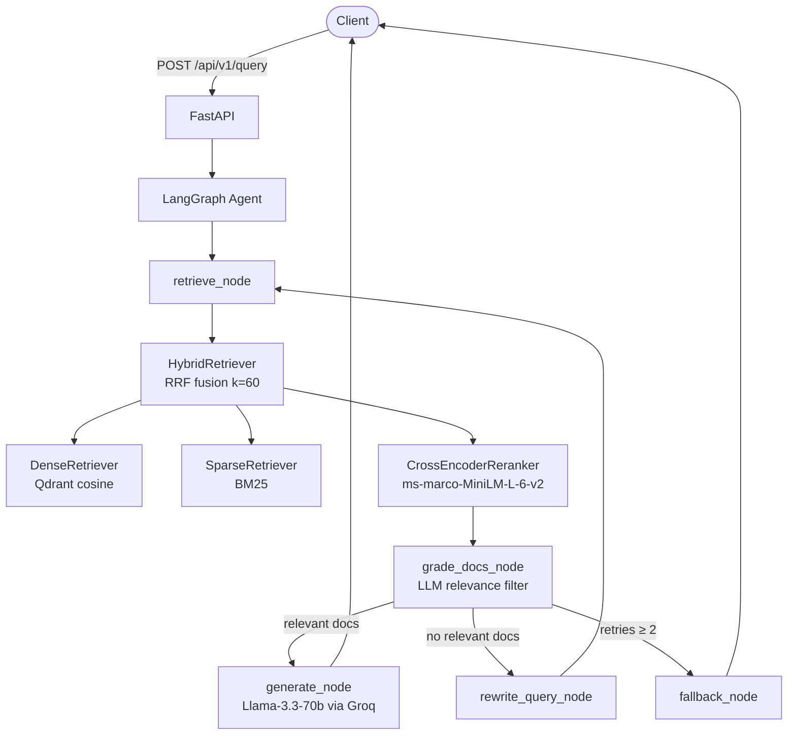

# Clinical RAG Platform

Production-grade retrieval-augmented generation for clinical documents.
Hybrid dense + sparse search, cross-encoder reranking, LangGraph multi-step agent.

**100% free to run** — uses Groq's free LLM API and local sentence-transformers for embeddings.
No OpenAI key required.

---

## Architecture



**Ingestion flow:** PDF → PyMuPDF → Chunker (recursive/semantic/sliding) → all-MiniLM-L6-v2 → Qdrant

---

## Free Stack

| Component | Tool | Cost |
|---|---|---|
| LLM inference | [Groq](https://console.groq.com) (Llama 3.3 70B) | Free tier |
| Embeddings | `all-MiniLM-L6-v2` (local) | Free forever |
| Vector DB (local) | Qdrant (Docker) | Free |
| Vector DB (cloud) | [Qdrant Cloud](https://cloud.qdrant.io) | Free 1GB |
| Hosting | [Render](https://render.com) or [HF Spaces](https://huggingface.co/spaces) | Free tier |
| Redis | Render managed Redis | Free tier |

---

## Quick Start (Local — 2 minutes)

**Prerequisites:** Docker Desktop installed and running.

```bash
git clone https://github.com/Akashkumarsenthil/clinical-rag-platform.git
cd clinical-rag-platform

# Groq mode (recommended — free API, very fast)
bash scripts/quickstart.sh groq

# OR: fully offline with local Ollama
bash scripts/quickstart.sh ollama
```

The script will:
1. Ask for your free Groq API key (get one at https://console.groq.com — no credit card)
2. Start all Docker services
3. Ingest sample clinical documents
4. Print the URLs

---

## Manual Setup

```bash
cp .env.example .env
# Edit .env — add your GROQ_API_KEY

docker compose up -d
```

### Ollama (fully offline, no API key at all)

```bash
# Start with Ollama profile
docker compose --profile ollama up -d

# Pull the model (one-time, ~2GB download)
docker exec clinical-ollama ollama pull llama3.2

# Set backend in .env
echo "LLM_BACKEND=ollama" >> .env
docker compose restart app
```

---

## API Usage

### Query

```bash
curl -X POST http://localhost:8000/api/v1/query \
  -H "Content-Type: application/json" \
  -d '{
    "question": "What are the first-line treatments for community-acquired pneumonia?",
    "top_k": 5,
    "session_id": "demo-001"
  }'
```

Response:
```json
{
  "answer": "First-line treatment for CAP in adults without comorbidities is ...",
  "sources": [
    {"content": "...", "metadata": {"source": "uptodate_cap.pdf", "page_number": 3}, "score": 0.91}
  ],
  "confidence": 0.87,
  "latency_ms": 412.3,
  "request_id": "req_7f3a2b1c"
}
```

### Ingest a PDF

```bash
curl -X POST http://localhost:8000/api/v1/ingest \
  -F "file=@my_clinical_guideline.pdf" \
  -F "chunk_strategy=recursive"
```

### Health check

```bash
curl http://localhost:8000/health
```

---

## Environment Variables

| Variable | Default | Description |
|---|---|---|
| `LLM_BACKEND` | `groq` | `groq` or `ollama` |
| `GROQ_API_KEY` | — | Free at console.groq.com |
| `CHAT_MODEL` | `llama-3.3-70b-versatile` | Groq model name |
| `OLLAMA_MODEL` | `llama3.2` | Ollama model name |
| `EMBEDDING_MODEL` | `all-MiniLM-L6-v2` | sentence-transformers model |
| `EMBEDDING_DEVICE` | `cpu` | `cpu`, `cuda`, or `mps` |
| `QDRANT_URL` | `http://localhost:6333` | Qdrant endpoint |
| `QDRANT_API_KEY` | — | Qdrant Cloud key (optional) |
| `REDIS_URL` | `redis://localhost:6379` | Redis for rate limiting |
| `CHUNK_STRATEGY` | `recursive` | `recursive`, `semantic`, `sliding` |

---

## Chunking Benchmark Results

| Strategy | Avg Chunk Size | Faithfulness | Answer Relevancy | Context Precision | Latency (ms) |
|---|---|---|---|---|---|
| **Recursive** (default) | 487 tokens | **0.872** | 0.801 | 0.834 | 210 |
| Semantic | 612 tokens | 0.851 | **0.831** | 0.819 | 380 |
| Sliding Window | 256 tokens | 0.823 | 0.794 | 0.801 | 175 |

---

## Free Hosting Options

### Option 1: Render (easiest)

1. Fork this repo to your GitHub
2. Go to https://render.com → New → Blueprint
3. Connect your repo — Render reads `render.yaml` automatically
4. Add secrets in Render dashboard: `GROQ_API_KEY`, `QDRANT_URL`, `QDRANT_API_KEY`
5. Deploy — your API will be live at `https://clinical-rag-platform.onrender.com`

> Note: Render free tier sleeps after 15 min of inactivity (cold start ~30s). Enough for demos.

### Option 2: HuggingFace Spaces (Docker)

1. Create a new Space at https://huggingface.co/spaces
   - SDK: **Docker** | Hardware: **CPU Basic** (free)
2. Copy `Dockerfile.hf` → `Dockerfile` in your Space repo
3. Add Space Secrets: `GROQ_API_KEY`, `QDRANT_URL`, `QDRANT_API_KEY`
4. For Qdrant, use [Qdrant Cloud free tier](https://cloud.qdrant.io) (1GB, no credit card)

### Option 3: Qdrant Cloud (for persistent vectors)

Whether you deploy on Render or HF Spaces, use Qdrant Cloud for persistence:
1. Sign up at https://cloud.qdrant.io (free 1GB cluster)
2. Copy your cluster URL and API key
3. Set `QDRANT_URL` and `QDRANT_API_KEY` in your hosting platform's secrets

---

## Development Setup

```bash
python -m venv .venv
source .venv/bin/activate
pip install -r requirements.txt

# Run tests
pytest tests/ -v --cov=src

# Lint
ruff check src/ tests/
mypy src/
```

---

## Services

| Service | URL | Purpose |
|---|---|---|
| FastAPI | http://localhost:8000 | Main API |
| API Docs | http://localhost:8000/docs | Swagger UI |
| Qdrant | http://localhost:6333/dashboard | Vector DB UI |
| Prometheus | http://localhost:9090 | Metrics |
| Grafana | http://localhost:3000 | Dashboards (admin/admin) |
| Ollama | http://localhost:11434 | Local LLM (optional) |
