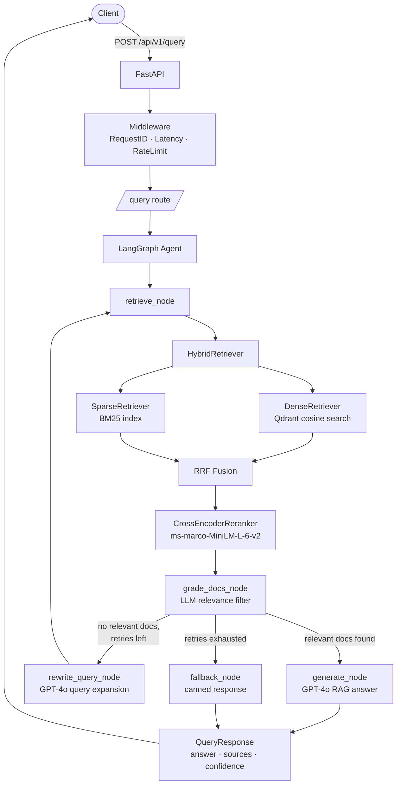
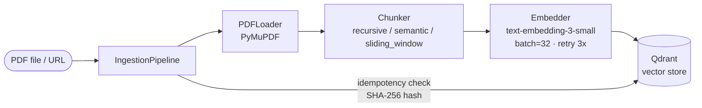

# System Architecture

## Overview

The Clinical RAG Platform is a production-grade retrieval-augmented generation system
designed for clinical document Q&A.  It combines dense vector search, BM25 sparse
retrieval, cross-encoder reranking, and a multi-step LangGraph agent to deliver
high-quality, sourced answers from clinical literature.

---

## Full Data Flow

### Query Path

### Ingestion Path

---

## Component Descriptions

| Component | Technology | Purpose |
|---|---|---|
| API Gateway | FastAPI 0.111 | REST endpoints, middleware, lifespan management |
| Agent Orchestration | LangGraph 0.1.19 | Multi-step retrieve→grade→generate loop |
| Dense Retrieval | Qdrant 1.9.2 + OpenAI embeddings | ANN cosine similarity search |
| Sparse Retrieval | rank-bm25 | BM25 keyword-based retrieval |
| Hybrid Fusion | Reciprocal Rank Fusion (k=60) | Combines dense + sparse ranked lists |
| Reranking | CrossEncoder ms-marco-MiniLM-L-6-v2 | Fine-grained query-passage scoring |
| PDF Parsing | PyMuPDF 1.24 | Fast PDF text extraction with section detection |
| Embedding | OpenAI text-embedding-3-small | 1536-dim dense vectors |
| Generation | GPT-4o | Grounded answer generation |
| Evaluation | RAGAS 0.1.10 | Faithfulness, relevancy, precision, recall |
| Metrics | Prometheus + Grafana | Latency, throughput, hit-rate observability |
| Tracing | OpenTelemetry (OTLP) | Distributed trace correlation |
| Caching/Rate-limit | Redis 7.2 | Per-IP rate limiting, future response caching |

---

## Scalability Notes

- **Horizontal scaling**: The FastAPI app is stateless; scale with multiple Uvicorn workers or Kubernetes replicas.
- **Qdrant**: Supports distributed mode (sharding + replication) for large corpora.
- **BM25 index**: Currently in-memory; for multi-worker setups, serialise with `pickle` and load from shared storage on startup.
- **Rate limiting**: The in-process `RateLimitMiddleware` should be replaced with a Redis-backed implementation in multi-worker deployments.
